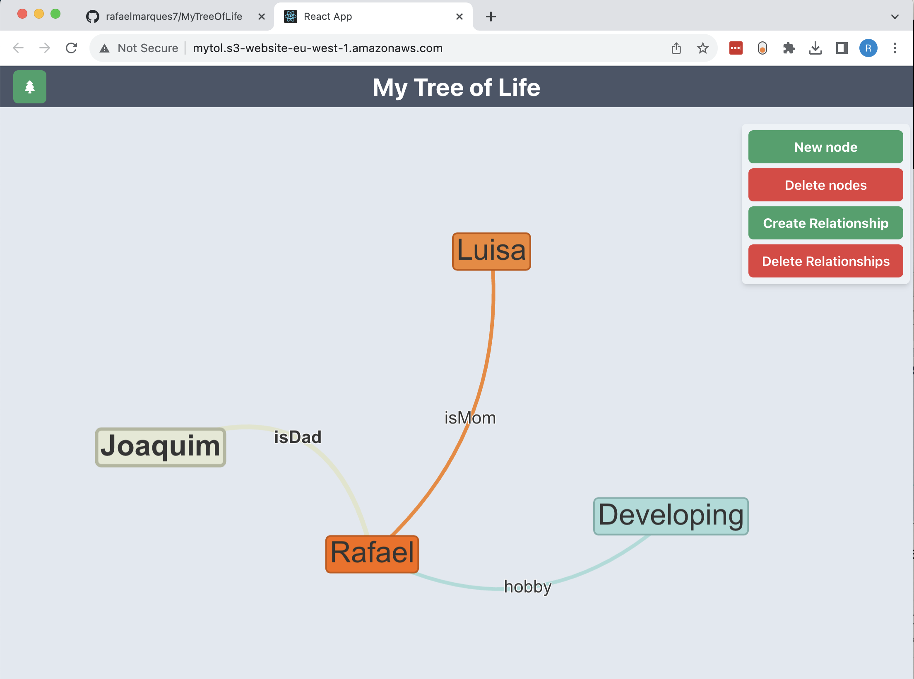

# React App for Graph DB with CRUD and visualizations

> Website is live: http://mytol.s3-website-eu-west-1.amazonaws.com/

This app uses a Neo4j Graph database, and allows the user to manipulate the database using commands input through the UI, built in React.



## Description

- `Neo4j` for graph database
- `React` with `ChakraUI`
- `TypeScript`
- `react-graph-vis` for graph visualization

## Connection to neo4j

- Connection to Neo4j requires the `.env` variables to be set (see [env.ts](./src/env.ts) file)
- This app can run without a connection to Neo4j. In this case, it uses some dummy data.

## ToDo's

Error handling and user warnings

- Create action container with 4 buttons: create/delete nodes, create/delete relationships
  - the new node opens the dialog we already have
  - the delete node makes the user select nodes by clicking on them on the screen
  - the delete node makes the user delete relationships by clicking on them on the screen
  - the create relationship allows the users to select:
    - a relationship label, by entering their own or choosing from a list
    - a starting node, by clicking on it first
    - a list of other nodes, by clicking on them
    - (finish by clicking on the create button on the screen)
- Create filtering, by node and relationship types
- Display different colors for different node and relationship types

## useful links:

```
it is possible to fix nodes and edges, see:
http://127.0.0.1:58253/examples/network/edgeStyles/arrowAlignment

edge coloring and hiding (visibility toggle):
http://127.0.0.1:58253/examples/network/data/dynamicFiltering

node color and shapes:
http://127.0.0.1:58253/examples/network/edgeStyles/colors

its possible to react to click and drag events:
http://127.0.0.1:58253/examples/network/events/interactionEvents

html, including images, inside nodes
http://127.0.0.1:58253/examples/network/labels/multilineText
http://127.0.0.1:58253/examples/network/labels/labelMultifont
http://127.0.0.1:58253/examples/network/nodeStyles/circularImages

it event supports clusters of cluster, relevant for visualizing large networks:
http://127.0.0.1:58253/examples/network/other/clusteringByZoom

keyboard controls:
http://127.0.0.1:58253/examples/network/other/navigation

```
